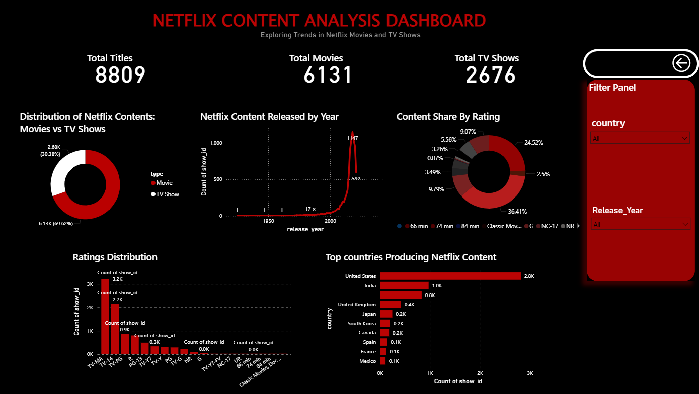
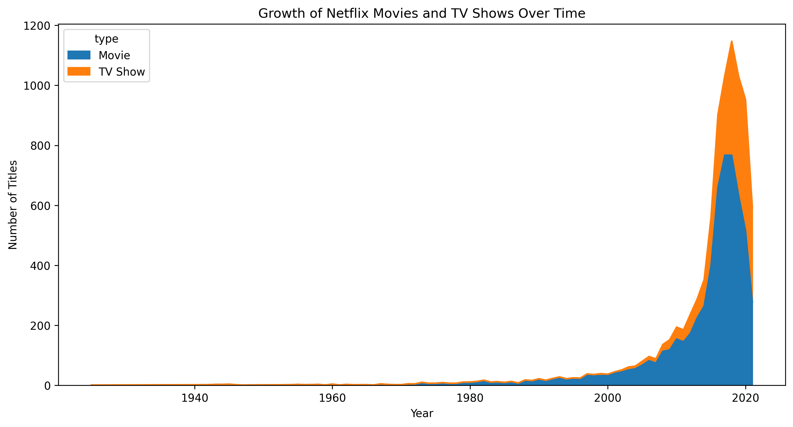
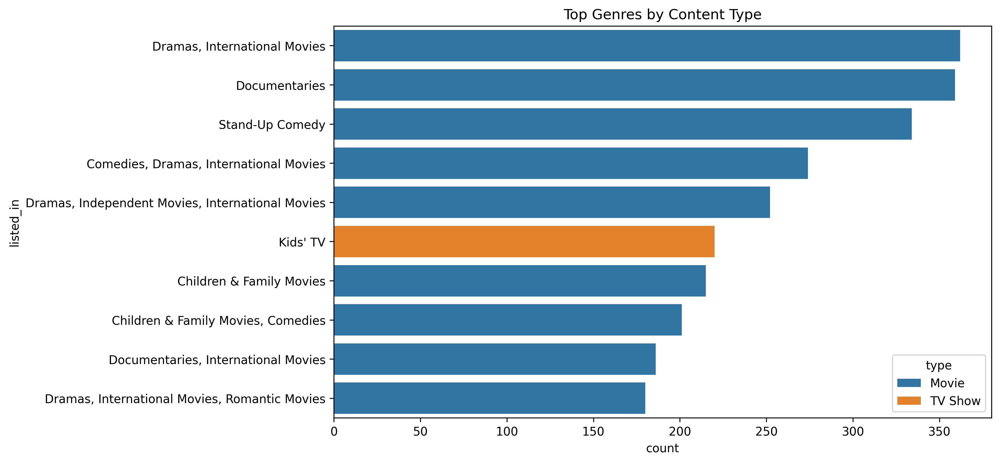
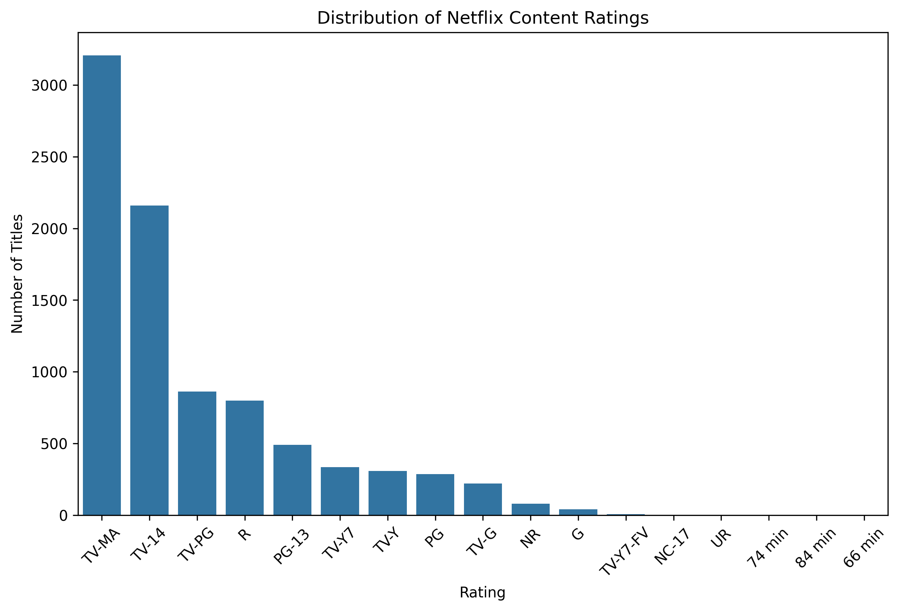
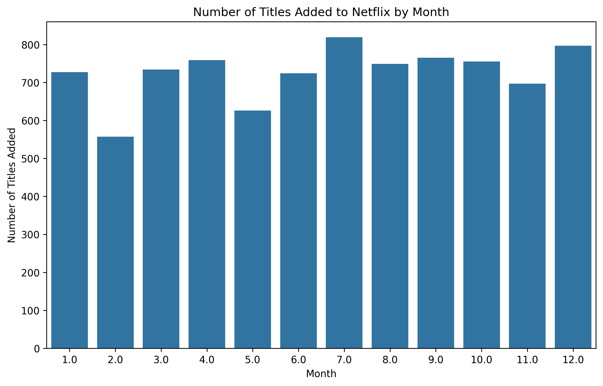
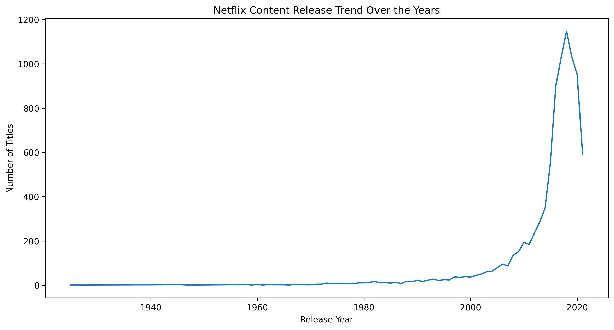
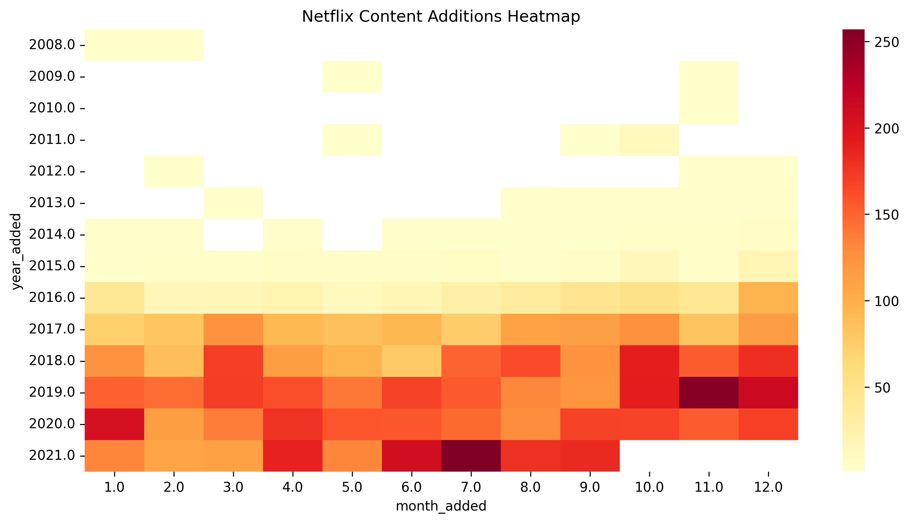
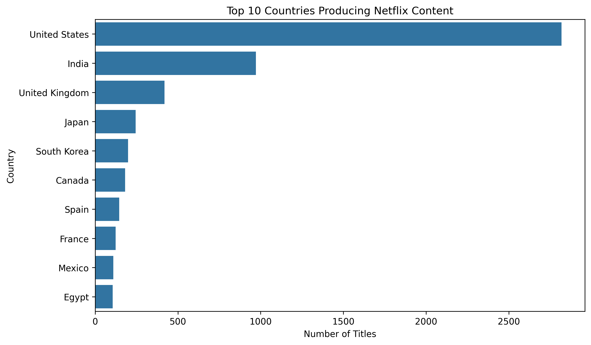
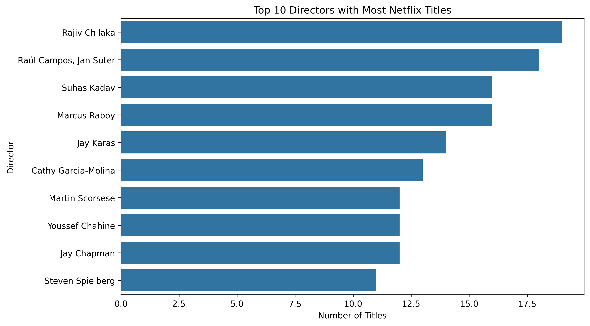

# Netflix Content Analysis Dashboard 📊

This project analyzes Netflix's content catalog using **Python for exploratory data analysis (EDA)** and **Power BI for interactive visualization**.

The goal of this analysis is to uncover patterns in Netflix's streaming catalog such as:

- Distribution of **Movies vs TV Shows**
- Growth of Netflix content over time
- **Rating distribution**
- **Top countries producing Netflix content**
- **Genre trends**
- Monthly and yearly content addition patterns

---

## Tools Used

- Python
- Pandas
- Matplotlib
- Seaborn
- Power BI

---

## Dataset

Netflix Movies and TV Shows Dataset.

The dataset contains information about Netflix titles including:

- Title
- Type (Movie / TV Show)
- Country
- Release Year
- Rating
- Genre
- Date Added

---

# Power BI Dashboard Preview



The Power BI dashboard provides insights into Netflix content distribution, ratings, production countries, and release trends.

### Key Metrics

- **Total Titles:** 8809  
- **Total Movies:** 6131  
- **Total TV Shows:** 2676  

The dashboard includes an **interactive filter panel** allowing users to explore the dataset by:

- Country
- Release Year

---

# Visual Insights

<table>
<tr>
<td align="center">
<b>Movies vs TV Shows</b><br>

</td>

<td align="center">
<b>Top Genres</b><br>

</td>
</tr>

<tr>
<td align="center">
<b>Ratings Distribution</b><br>

</td>

<td align="center">
<b>Titles Added by Month</b><br>

</td>
</tr>

<tr>
<td align="center">
<b>Release Trend</b><br>

</td>

<td align="center">
<b>Content Addition Heatmap</b><br>

</td>
</tr>

<tr>
<td align="center">
<b>Top Countries</b><br>

</td>

<td align="center">
<b>Top Directors</b><br>

</td>
</tr>
</table>

---

# Project Structure

```
NETFLIX
│
├── dashboard
│   └── dashboard.pbix
│
├── data
│   └── netflix_titles.csv
│
├── visuals
│   ├── content_additions_heatmap.png
│   ├── content_ratings.png
│   ├── dashboard.png
│   ├── movies_vs_tvshows.png
│   ├── release_trend.png
│   ├── titles_by_month.png
│   ├── top_countries.png
│   ├── top_directors.png
│   └── top_genres.png
│
└── netflix_analysis.ipynb
```

---

# Key Takeaways

- Netflix hosts significantly more **Movies than TV Shows**
- **Drama and International Movies** dominate the platform
- **TV-MA and TV-14** are the most common ratings
- The **United States produces the largest share of content**
- Netflix's content library has grown significantly over time

---

# Author

**Kaustubh**

